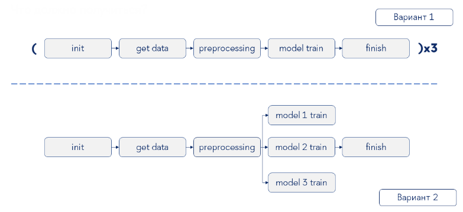

# Пайплайн обучения моделей в Arflow и MLFlow

- **data_to_postgres.ipynb** - сохраняет датасет Postgres
- **MLFlow_training.ipynb** - сохраняет эксперимент MLFlow
- **train_one_model.py** - DAG для тренировки одной модели
- **train_three_models_1.py, train_three_models_2.py** - DAG для тренировки трех моделей

- **MLFlow_train_models.py** - DAG для обучения трех моделей, сохранения датасетов и результатов в S3, записи эксперимента в MLFlow Tracking 
    - *выгрузка данных из Postgres*
    - *загрузка данных в S3*
    - *чтение данных из S3*
    - *обработка данных*
    - *сохранение обработанных данных в S3*
    - *загрузка обработанных из S3*
    - *обучение моделей*
    - *сохранение результатов обучения с помощью MLFlow*
    - *сохранение модель в артифактори*
    - *сохранение результатов в S3*